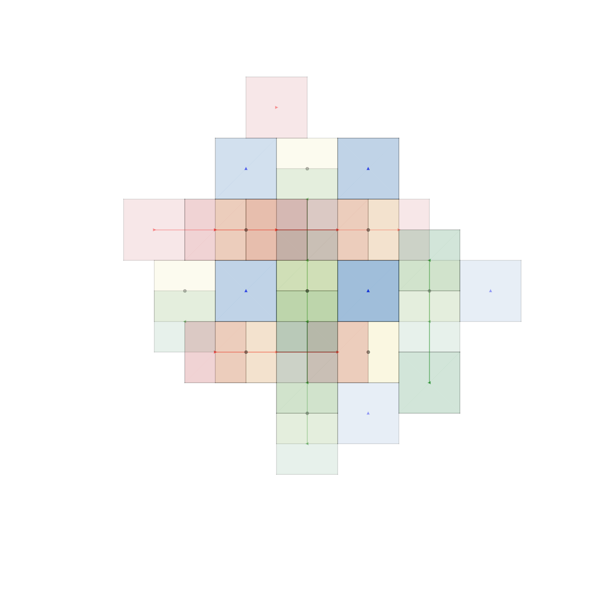
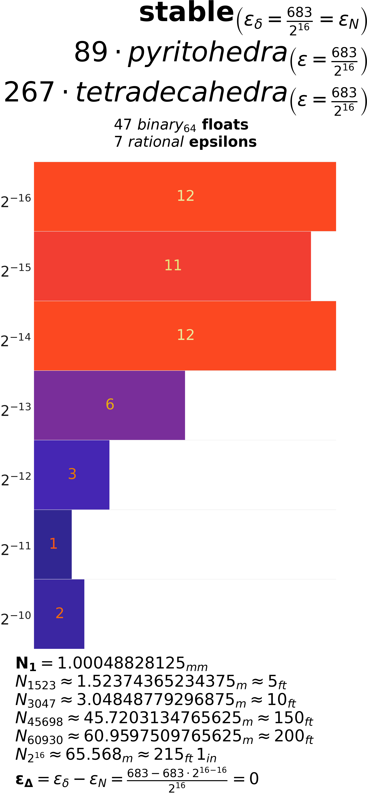

<figure id="fig-intro">

<figcaption>Illustration of the <em>A15</em> structure (<span
class="math inline">\(\beta\)</span>–<span
class="math inline">\(W\)</span>) at three different scales, generated
using <code>A15.py</code> (<code>fig-intro.png.txt</code>). The
visualization highlights the constituent pyritohedral and
tetradecahedral elements, demonstrating how the structure maintains its
fundamental <span class="math inline">\(Pm\bar{3}n\)</span> space group
symmetry while revealing increasing detail at finer
resolutions.</figcaption>
</figure>

# Introduction: Floats, Fairness, and the A15 Foundation

Binary floating-point numbers, commonly known as “floats” and largely
governed by the IEEE 754 standard (IEEE 2019), are the computational
workhorses for representing real numbers. They offer a vast dynamic
range essential for graphics and science, yet this reach often comes at
the cost of precision. Floats are notorious for providing *approximately
correct* answers[^1], representing most values inexactly. These tiny,
fundamental representation errors, inherent in their structure
(<a href="#eq-float-representation" data-reference-type="ref+Label"
data-reference="eq-float-representation">[eq-float-representation]</a>),
can accumulate and interact, particularly challenging the deterministic
consistency required for networked virtual reality (VR), distributed
simulations, and the burgeoning metaverse. This research confronts these
challenges head-on, proposing an alternative spatial representation
rooted in the unique crystallographic properties of the *A15* phase
structure ($`\beta`$–$`W`$, space group $`Pm\bar{3}n`$, No. 223 (Aroyo
2016)), as illustrated in
<a href="#fig-intro" data-reference-type="ref+Label"
data-reference="fig-intro">1</a>.

## The Challenge of Floating-Point Precision

Standard normalized binary floating-point numbers derive their value
from three components: a sign bit, a biased exponent, and a significand
(mantissa). Conceptually[^2], their value relates to:
``` math
\label{eq-float-representation}
    \text{value} = (-1)^{\text{sign}} \times (1 + \text{significand}) \times 2^{\text{exponent}}
```
The fixed-size significand offers constant *relative* precision within
an exponent range, while the exponent scales the value logarithmically.
This design excels at exactly representing powers of two and fractions
whose denominators are solely powers of two, but only a finite subset
thereof. Consequently, most decimal values and even many simple
fractions (e.g., $`1/10`$) are merely approximated (Goldberg 1991).

While seemingly minuscule, these representation errors can compound,
critically affecting reproducibility. In distributed systems like
multiplayer games or collaborative VR, this becomes paramount. Identical
logical inputs processed on different hardware architectures, operating
systems, or even with different compiler optimizations can yield subtly
divergent floating-point results. This variance breaks simulation
consistency, undermines fairness in competition (Claypool and Claypool
2006), complicates debugging and verification, and fundamentally opposes
the requirement for determinism. Yet, widespread hardware acceleration
makes IEEE 754 formats—primarily binary32 (32, single-precision) and
binary64 (64, double-precision)—ubiquitous in modern CPUs and GPUs.
Binary32, in particular, remains vital for performance-sensitive
applications like game development and VR, establishing a key baseline
for efficiency comparisons. This work, therefore, accepts the practical
necessity of floats but seeks to structure their use, mitigating risks
to determinism via the disciplined partitioning and verifiable scaling
offered by the *A15* framework detailed in
<a href="#sec-framework-design" data-reference-type="ref+Label"
data-reference="sec-framework-design">2</a>.

## The A15 Phase Structure: A Crystallographic Foundation

Effectively partitioning virtual space requires a measure of geometric
“fairness”—a balance between **isometry** (preserving distances between
corresponding points) and **isotropy** (uniformity of properties across
different directions). Discretizing continuous space onto a lattice
while preserving both ensures that spatial relationships remain
consistent and free from directional bias. While regular lattices
achieve perfect isometry through translational symmetry, attaining high
isotropy is constrained by fundamental geometric principles. The
continuous rotational symmetry group in 3D, $`SO(3)`$, implies that
highly isotropic structures should appear locally spherical. However,
the imposition of discrete translational symmetry restricts the allowed
rotational symmetries to only 1-, 2-, 3-, 4-, and 6-fold axes. This is
the essence of the **crystallographic restriction theorem** (Ashcroft
and Mermin 1976), which explicitly forbids the global 5-fold symmetry
characteristic of highly isotropic polyhedra like the icosahedron
(associated with the $`I_h`$ point group symmetry (Coxeter 1973)) in
periodic lattices.

The *A15* structure ($`Pm\bar{3}n`$, No. 223 (Aroyo 2016)) navigates
this restriction with notable elegance. It is based on the simple
primitive cubic ($`cP`$) Bravais lattice but incorporates a complex
basis (or motif) containing two distinct types of crystallographic sites
within its conventional unit cell (Frank and Kasper 1958, 1959), as
illustrated in <a href="#fig-cell2" data-reference-type="ref+Label"
data-reference="fig-cell2">2</a>:

- 25% are C12 sites: 12-coordinated, occupying Wyckoff position 2a
  (e.g., at fractional coordinates $`(0, 0, 0)`$ and
  $`(1/2, 1/2, 1/2)`$). Their local coordination environment exhibits
  characteristics related to pyritohedral symmetry.

- 75% are C14 sites: 14-coordinated, occupying Wyckoff position 6d
  (e.g., at $`(1/4, 1/2, 0)`$ and its symmetry equivalents (Aroyo
  2016)). Their local environment resembles a tetradecahedron (a
  14-faced polyhedron).

This intricate arrangement results in a high average coordination
number, calculated as
$`Z_{avg} = (0.25 \times 12) + (0.75 \times 14) = 13.5`$, suggesting a
densely connected local structure conducive to efficient packing. The
local symmetry around these sites is described by the crystallographic
point group $`T_h`$ ($`m\bar{3}`$, order 24). Significantly, $`T_h`$ is
a maximal subgroup common to both the full cubic symmetry group $`O_h`$
(order 48) and the non-crystallographic icosahedral group $`I_h`$ (order
120) (Coxeter and Moser 1972). While lacking the forbidden 5-fold axes
of $`I_h`$, $`T_h`$ retains key 3-fold rotational symmetries present in
icosahedral structures. This unique symmetry allows the *A15* structure
to incorporate significant near-icosahedral local ordering, boosting
local isotropy considerably compared to simpler cubic structures, all
while maintaining the long-range periodicity required by
crystallography. The structure also features alternating left- and
right-handed local environments around the 6d sites, adding further
complexity relevant to implementation
(<a href="#subsubsec-limits-handedness" data-reference-type="ref+Label"
data-reference="subsubsec-limits-handedness">3.3.5</a>).

Crucially for this work, the canonical definition of the *A15* structure
relies on fractional coordinates inherently suitable for binary
representation: $`0`$, $`1/4`$, and $`1/2`$. These values are exactly
representable in base-2 systems. When these fractional coordinates are
mapped onto an integer lattice (conceptually, by scaling the unit cell
coordinates by 4, aligning with the derivation of the 96-unit baseline
in <a href="#subsubsec-scaling-baseline" data-reference-type="ref+Label"
data-reference="subsubsec-scaling-baseline">2.2.3</a>), two
characteristic squared site-to-site distances emerge within this integer
framework: $`d^2 = 4`$ (yielding distance 2) and $`d^2 = 5`$ (yielding
distance $`\sqrt{5}`$). The presence of $`\sqrt{5}`$, the hypotenuse of
a fundamental 2:1 right triangle, connects the structure’s geometry
directly to the golden ratio $`\phi = (1+\sqrt{5})/2`$, further
reflecting the embedded near-icosahedral characteristics. This intrinsic
numerical simplicity and compatibility with base-2 representation
ensures that the *A15* structure can be defined and scaled with
precision, forming a robust foundation for the numerically stable
encoding framework developed herein
(<a href="#subsec-stability" data-reference-type="ref+Label"
data-reference="subsec-stability">2.3</a>).

<figure id="fig-cell2">

<figcaption>Components illustrating the local arrangement within a
left-handed <span class="math inline">\(^1/_2\)</span> unit cell
fragment of the <em>A15</em> structure. Shows C12 (Wyckoff 2a, center of
pyritohedral environment) and C14 (Wyckoff 6d, center of tetradecahedral
environment) sites demonstrating the local complexity within the overall
<span class="math inline">\(Pm\bar{3}n\)</span> symmetry. Generated via
<code>A15.py</code> (<code>fig-cell2.png.txt</code>).</figcaption>
</figure>

## Local Discretization Methods: WPH and TSP

While the *A15* structure defines the target lattice points for
coordinate encoding, mapping arbitrary continuous coordinates from a
virtual environment onto these discrete identifiers requires a
well-defined *local discretization method*. This method effectively
defines the boundaries of the region (the “cell”) surrounding each *A15*
site; any continuous point falling within a given cell is quantized or
mapped to that specific site’s identifier. This framework primarily
considers two such methods, both intrinsically linked to the *A15*
structure, sharing its $`Pm\bar{3}n`$ space group symmetry, and
implemented within the accompanying `A15.py` software
(<a href="#fig-wp-ts" data-reference-type="ref+Label"
data-reference="fig-wp-ts">3</a>):

<div class="description">

This research utilizes the geometric polyhedral form of the
Weaire–Phelan structure as a partitioning method. It divides space using
cells of two distinct shapes: a 12-faced pyritohedron and a 14-faced
tetradecahedron, arranged in a precise 1:3 ratio (Weaire and Phelan
1994). These cell shapes correspond topologically to the local
coordination environments of the C12 and C14 sites within the *A15*
structure, respectively. This partitioning is notable for its high
degree of isotropy, closely mirroring the symmetry characteristics of
the underlying lattice. (It is important to distinguish this geometric,
space-filling honeycomb from the related but distinct relaxed,
minimal-surface structure which famously provided a counter-example to
Kelvin’s conjecture on foam partitioning (Thomson 1887; Kusner and
Sullivan 1996; Weaire and Hutzler 2001).)

A structurally simpler alternative partitioning method, activated within
`A15.py` via the `stix=True` configuration option. This method employs
axis-aligned planar faces, effectively dividing space into cubic blocks
centered on the *A15* lattice sites. While offering computational
advantages for certain operations (such as point-in-cell tests) due to
its simpler geometry, this approach generally exhibits lower isotropy
compared to the Weaire–Phelan Honeycomb method.

</div>

Crucially, both the Weaire–Phelan Honeycomb and the Tetrastix Prism
serve as interchangeable local discretization methods within this
framework. They define the specific geometry used to quantize continuous
space around each *A15* lattice site. The choice influences the precise
shape of these local regions and boundaries, impacting factors like the
resulting partition’s isotropy and the computational cost of the
quantization step itself. However, the fundamental coordinate identifier
that is ultimately transmitted or stored remains based on the position
within the underlying *A15* lattice, regardless of which local method is
used for the mapping.

<figure id="fig-wp-ts">
<p> </p>
<figcaption>Visualization of local discretization methods related to the
underlying <em>A15</em> structure. Left: The geometric polyhedral
variant of the <strong>Weaire–Phelan Honeycomb</strong>, featuring
pyritohedra (12 faces) and tetradecahedra (14 faces). Right: The simpler
<strong>Tetrastix Prism</strong> partitioning using axis-aligned planar
faces resulting in cubic blocks centered on <em>A15</em> sites. Both
share the <span class="math inline">\(Pm\bar{3}n\)</span> space group
symmetry. Generated using <code>A15.py</code>
(<code>fig-wp.png.txt</code> and
<code>fig-ts.png.txt</code>).</figcaption>
</figure>

## Distinction from Traditional Spatial Indexing

The *A15*-based partitioning approach presented here relates to, yet
fundamentally differs from, traditional spatial indexing techniques
commonly employed in databases, geographic information systems (GIS),
and various domains of computer graphics (e.g., octrees (Finkel and
Bentley 1974), R-trees (Guttman 1984), k-d trees (Bentley 1975); see
(Samet 1990) for a comprehensive overview). Conventional indexing
methods typically utilize data-driven, adaptive strategies; their
partitioning boundaries often adjust dynamically based on the
distribution and density of existing spatial objects, with the primary
goal of optimizing query performance (such as range searches or nearest
neighbor lookups) for that specific dataset.

In stark contrast, the *A15* framework imposes a predetermined, regular,
crystallographically-inspired structure onto the virtual space itself,
largely independent of the dynamic content residing within it. This
*structure-first* methodology prioritizes the creation of a universal,
efficient, and geometrically sound fabric for spatial representation and
encoding. The key distinctions are summarized in
<a href="#tab-comparison-indexing" data-reference-type="ref+Label"
data-reference="tab-comparison-indexing">1</a>. The *A15* approach
deliberately trades the dynamic query optimization focus of traditional
indexing for significant advantages in predictability, communication
efficiency (via compact identifiers that implicitly encode the regular
structure), guaranteed numerical determinism (when using stable scaling
regimes), and inherent geometric consistency derived from
crystallographic symmetry—properties particularly valuable for networked
virtual environments demanding shared spatial understanding, robustness
against floating-point discrepancies, and efficient state
synchronization.

<div id="tab-comparison-indexing">

| **Characteristic** | **Traditional Spatial Indexing**(e.g., Octree (Finkel and Bentley 1974), R-tree (Guttman 1984), k-d tree (Bentley 1975)) | ***A15* Crystallographic Partitioning** |
|:---|:---|:---|
| Primary Objective | Efficient query/retrieval of existing, often arbitrary, data | Uniform, deterministic spatial discretization and efficient coordinate encoding |
| Partition Strategy | Data-driven; adaptive boundaries; often hierarchical; structure follows data | Structure-driven; regular lattice; predetermined boundaries (via WPH/TSP local methods); data follows structure |
| Symmetry Awareness | Generally low; structure adapts to data, often breaking ambient symmetries | High; leverages crystallographic symmetry ($`T_h`$, $`Pm\bar{3}n`$) of the imposed lattice |
| Coordinate Handling | Typically preserves input precision (e.g., float coordinates) | Quantizes coordinates to discrete representations (*A15* identifiers, often integers) |
| Memory Usage | Variable, depends on data density/distribution; includes tree/node overhead | Predictable based on defined scale/volume; highly efficient storage using integer identifiers |
| Isotropy | Variable; depends heavily on data distribution and algorithm specifics | High local isotropy inherent in the *A15* structure, especially when using Weaire–Phelan Honeycomb partitioning |
| Neighborhood Info | Requires explicit tree traversal or complex range/proximity queries | Implicit, regular neighbor relationships directly derivable from the lattice structure |
| Temporal Stability | Partitioning structure can change significantly as data moves or updates | Fixed partitioning grid provides temporal coherence for coordinate mapping (though content moves within) |
| Determinism Guarantee | Generally low; susceptible to float variance affecting boundary tests/traversal | High; guaranteed bit-level consistency achievable with stable scaling regimes ($`\epsilon_\Delta = 0`$) |
| Primary Use Case | Databases, GIS (Samet 1990), dynamic collision detection, view frustum culling | Foundational spatial fabric for deterministic VR/simulations, compact coordinate encoding, networked state consistency, verifiable replays |

Comparison of Spatial Organization Approaches.

</div>

## Comparative Context: Other Symmetric Structures

The 230 crystallographic space groups categorize all possible ways to
combine periodic translational symmetry (defined by the 14 Bravais
lattices) with rotational and reflectional symmetries (defined by the 32
crystallographic point groups) in 3D space (Aroyo 2016). Situating the
*A15* structure (space group $`Pm\bar{3}n`$, No. 223) within this
framework highlights its distinctive characteristics relevant to packing
and partitioning
(<a href="#tab-spacegroups" data-reference-type="ref+Label"
data-reference="tab-spacegroups">2</a>).

<div id="tab-spacegroups">

| **Structure Type** | **No.** | **HM Symbol** | **Point Group** | **Order** | **Bravais Lattice** |
|:---|:--:|:--:|:--:|:--:|:---|
| ***A15* Type** | **223** | $`\boldsymbol{Pm\bar{3}n}`$ | $`\boldsymbol{m\bar{3}}`$ $`\boldsymbol{(T_h)}`$ | **24** | **Primitive (cP)** |
| Simple Cubic (SC) | 221 | $`Pm\bar{3}m`$ | $`m\bar{3}m`$ $`(O_h)`$ | 48 | Primitive (cP) |
| BCC Type (e.g., W) | 229 | $`Im\bar{3}m`$ | $`m\bar{3}m`$ $`(O_h)`$ | 48 | Body-Centered (cI) |
| FCC Type (e.g., Cu) | 225 | $`Fm\bar{3}m`$ | $`m\bar{3}m`$ $`(O_h)`$ | 48 | Face-Centered (cF) |

Comparison of Relevant Cubic Space Groups.

</div>

Data sourced from International Tables for Crystallography, Vol A (Aroyo
2016). HM Symbol: Hermann-Mauguin notation.

As shown, *A15*’s $`Pm\bar{3}n`$ space group utilizes the primitive
cubic ($`cP`$) Bravais lattice but applies the $`T_h`$ point group
symmetry (order 24). This group possesses lower overall symmetry than
the full cubic $`O_h`$ group (order 48) characteristic of the
highest-symmetry simple cubic, body-centered cubic (BCC, $`cI`$), and
face-centered cubic (FCC, $`cF`$) structures. However, as discussed
(<a href="#subsec-intro-a15" data-reference-type="ref+Label"
data-reference="subsec-intro-a15">1.2</a>), the specific $`T_h`$
symmetry is significant because it represents a maximal crystallographic
subgroup linking cubic ($`O_h`$) and non-crystallographic icosahedral
($`I_h`$) symmetries (Coxeter and Moser 1972). This unique combination
allows the *A15* structure to accommodate its complex basis with
distinct C12 and C14 sites, enabling its exceptionally high average
coordination number (13.5), which relates to efficient local packing and
high connectivity.

When compared to common space-filling honeycombs and related sphere
packings, the *A15* structure, particularly when coupled with
the Weaire–Phelan Honeycomb partitioning method, offers further
distinctions relevant to this framework:

- **vs. BCC-derived Structures:** The body-centered cubic lattice (BCC,
  coordination number Z=8) and its dual, the bitruncated cubic honeycomb
  (Kelvin’s structure (Thomson 1887)), have lower fundamental
  coordination than *A15* (13.5), suggesting a less densely connected
  local environment.

- **vs. FCC-derived Structures:** The face-centered cubic lattice (FCC,
  coordination Z=12) represents the densest packing of identical spheres
  (Conway and Sloane 1999) and is related to the rhombic dodecahedral
  honeycomb. While achieving maximal coordination for identical points,
  *A15* surpasses this average by utilizing two distinct, efficiently
  arranged site types.

- **vs. the Weaire–Phelan Honeycomb:** The geometric
  Weaire–Phelan Honeycomb, used as a local discretization method, shares
  the $`Pm\bar{3}n`$ space group and its cell types correspond
  topologically to the A15 site environments. This ensures the
  partitioning boundaries naturally align with the symmetries and
  neighborhood relationships of the underlying A15 encoding lattice, a
  unique synergy not offered by partitions derived from simpler
  lattices.

In summary, the unique combination offered by the *A15* structure—its
high mean coordination, significant local isotropy via $`T_h`$ symmetry,
a direct relationship to the compatible Weaire–Phelan Honeycomb
partitioning structure, and inherently binary-suitable base
coordinates—makes it exceptionally well-suited for the deterministic,
efficient, and geometrically sound spatial encoding framework proposed
here.

# The *A15* Encoding Framework: Design and Implementation

The heart of this research lies in translating the idealized
crystallographic description of the *A15* structure
(<a href="#subsec-intro-a15" data-reference-type="ref+Label"
data-reference="subsec-intro-a15">1.2</a>) into a practical, numerically
robust system for partitioning continuous 3D space and encoding
coordinates. This requires establishing an appropriate and consistent
scale, mapping continuous coordinates to discrete lattice identifiers,
and ensuring the process avoids the pitfalls of floating-point
approximation
(<a href="#subsec-intro-floats" data-reference-type="ref+Label"
data-reference="subsec-intro-floats">1.1</a>). The framework achieves
this through a carefully staged approach to coordinate scaling,
primarily operating within an internal integer coordinate system during
geometric construction to preserve fidelity and defer floating-point
conversion until the final output step. This section details this
methodology and introduces the reference implementation, `A15.py`
(Risinger 2024a), used throughout this work for generation, analysis,
and validation.

## Core Principle: Internal Integer Representation

Applying a discrete lattice like *A15* to represent continuous space
necessitates a rigorous scaling framework. Simply using floating-point
coordinates throughout the geometric construction risks introducing the
very numerical inconsistencies the framework aims to eliminate.
Therefore, the methodology prioritizes calculations within a
well-defined internal integer coordinate system, delaying the mapping to
inexact output formats until the final step. This preserves the precise
geometric relationships inherent in the *A15* structure and forms the
bedrock for numerical stability.

## Multi-Stage Scaling Pipeline

The conversion from the abstract *A15* definition to concrete
coordinates involves a systematic, multi-stage pipeline implemented
within `A15.py`. This process uses several interacting parameters and
fixed factors to progressively build the structure within the internal
integer system before final output scaling. The key stages are detailed
below, and the parameters are summarized in
<a href="#tab-scaling-params" data-reference-type="ref+Label"
data-reference="tab-scaling-params">3</a>.

### Primitive Definition and Resolution (`prescale`)

The pipeline originates with the definition of the fundamental geometric
units associated with the *A15* basis sites—typically the pyritohedra
and tetradecahedra related to the Weaire–Phelan Honeycomb method
(<a href="#subsec-intro-partitioning" data-reference-type="ref+Label"
data-reference="subsec-intro-partitioning">1.3</a>), or the cubic blocks
for the Tetrastix Prism method. Functions within `A15.py` (e.g.,
`pyritohedron()`, `tetradecahedra()`) apply an internal integer
multiplier, the `prescale` parameter, to the canonical *dimensionless
fractional* coordinates (like $`0, 1/4, 1/2`$) defining the vertices of
these shapes. This crucial first step converts the fractional values
into *primitive-relative integer coordinates*, establishing the minimum
resolution necessary to accurately represent the individual geometric
primitives without internal approximation. Default `prescale` values in
`A15.py` (typically 20 for standard WPH-derived shapes, 24 for
TSP-derived shapes via `stix=True`) are chosen specifically to ensure
these base vertices land precisely on an integer grid relative to the
shape’s center.

### Lattice Placement (Factor 24)

The `lattice()` function in `A15.py` replicates these integer-vertex
polyhedra periodically across 3D space according to the $`Pm\bar{3}n`$
symmetry rules. It determines the positions for the *centers* of these
polyhedra based on *integer lattice vectors* `xyz` relative to an origin
offset `o`. A key element in this placement is the fixed **Lattice
Spacing Factor of 24 units**. Within the `lattice()` function, the
calculation `(xyz + o) * 24` multiplies the integer lattice vector by
this factor. This defines the spacing between the nominal lattice points
(i.e., the centers of the polyhedra) *measured in the integer units
established by `prescale`*. This factor ensures the correct relative
positioning of the repeating units within the overall *A15* lattice
framework.

### Basis Accommodation (Factor 96 Baseline)

The *A15* structure’s complexity arises from its multi-atom basis; it
contains distinct crystallographic sites (Wyckoff 2a and 6d) not just at
the nominal lattice points defined above, but also at specific
fractional offsets, notably involving $`1/4`$ for the 6d sites. To place
*all* required sites onto a single, consistent internal integer grid
requires a resolution finer than the 24-unit spacing factor alone
provides. The smallest denominator involved is 4 (from $`1/4`$).
Therefore, the internal integer grid must be conceptually scaled such
that one unit step along a primitive lattice vector corresponds to
$`4 \times 24 = 96`$ internal integer units along each principal axis.

This derived **Effective Lattice Unit Factor of 96** represents the
fundamental period or effective unit dimension of the comprehensive
internal integer grid required to represent the *complete* *A15*
structure (including its basis) without loss of precision due to these
fractional offsets. This factor of 96 establishes the crucial **baseline
dimension** relative to which the structure’s inherent numerical
precision requirements ($`\epsilon_N`$, see
<a href="#subsubsec-stability-epsilon-n" data-reference-type="ref+Label"
data-reference="subsubsec-stability-epsilon-n">2.3.2</a>) are determined
and against which the final output scale ($`\epsilon_\delta`$) is
compared for stability analysis.

### Optional Binary Rescaling (`rescale`)

Before the lattice generation stage fully populates the internal integer
coordinates, an optional power-of-two scaling factor, `rescale`, can be
applied. This factor is specified via the `-rescale` command-line flag
or implicitly through ‘+/-‘ suffixes appended to shape names in the
input (e.g., `pyritohedra++` implies a rescale factor of $`2^2=4`$ in
`A15.py`). This `rescale` factor multiplies the effective size
represented by the internal integer coordinates relative to the 96-unit
baseline established above. It allows adjustments to the overall size or
relative proportions of different generated components *before* the
final output scaling step, operating purely in powers of two within the
integer domain. Importantly, the choice of `rescale` influences the
resulting inherent base scale $`\epsilon_N`$ of the internal geometry.

### Resultant Internal Integer Coordinates

The cumulative effect of the initial `prescale`
(<a href="#subsubsec-scaling-prescale" data-reference-type="ref+Label"
data-reference="subsubsec-scaling-prescale">2.2.1</a>), the lattice
placement logic
(<a href="#subsubsec-scaling-lattice" data-reference-type="ref+Label"
data-reference="subsubsec-scaling-lattice">2.2.2</a>, establishing the
96-unit effective baseline
<a href="#subsubsec-scaling-baseline" data-reference-type="ref+Label"
data-reference="subsubsec-scaling-baseline">2.2.3</a>), and any applied
`rescale` factor
(<a href="#subsubsec-scaling-rescale" data-reference-type="ref+Label"
data-reference="subsubsec-scaling-rescale">2.2.4</a>) collectively
defines the complete set of vertex coordinates for the entire generated
structure. These coordinates exist within a consistent, potentially
large-valued, *internal integer* system referenced against the 96-unit
effective lattice baseline. By prioritizing integer arithmetic
throughout these construction stages, `A15.py` preserves the precise
geometric relationships inherent in the *A15* structure, deferring any
floating-point approximation until the very last output step. This
internal integer representation forms the bedrock for the numerical
stability analysis detailed next.

<div id="tab-scaling-params">

| **Parameter/Factor** | **Role and Implementation in `A15.py`** |
|:---|:---|
| `prescale` | Internal integer multiplier applied within shape functions (e.g., `pyritohedron()`). Converts base fractional coordinates (0, 1/4, 1/2, etc.) to integer vertices relative to shape center. Establishes primitive resolution (Defaults: 20 WPH, 24 TSP). |
| Lattice Spacing Factor (24) | Fixed factor used in `lattice()`. Multiplies integer lattice vectors `xyz` to determine nominal lattice point positions relative to origin offset `o`, measured in units defined by `prescale`. |
| Effective Lattice Unit Factor (96) | Derived factor ($`4 \times 24 = 96`$). Represents the fundamental period of the internal integer grid along a principal axis needed to accommodate *A15* basis site offsets (like 1/4) precisely. **This is the internal baseline dimension** relative to which inherent precision $`\epsilon_N`$ and output scale $`\epsilon_\delta`$ are compared. |
| `rescale` | Optional pre-generator power-of-two scaling (via `-rescale` flag or `+/-` suffixes). Multiplies internal integer coordinates, adjusting size relative to the 96-unit baseline *before* final output scaling. Affects the resulting $`\epsilon_N`$. |
| `scale` ($`\epsilon_\delta`$) | Final global scaling factor (`-scale=<value>`) applied by `figure()` after internal integers are generated. Maps internal integers (relative to the 96-unit baseline) to output coordinates (typically float). Sets real-world size and determines numerical stability regime ($`\epsilon_\Delta`$) by comparison with $`\epsilon_N`$. Accepts various formats (integer, fraction, power, float). |
| `n` | Controls lattice extent (`-n=<value>`). Integer specifies cuboid dimensions (number of lattice cells defined by the 96-unit baseline along axes); float specifies a spherical radius cutoff based on lattice vector magnitude relative to the origin. |

Summary of Key Scaling Parameters and Factors in `A15.py`.

</div>

## Numerical Stability: Regimes and Validation

Achieving deterministic spatial representation—ensuring that identical
logical operations yield bit-identical results across different
systems—is a primary motivation for this framework. This guarantee
hinges critically on the relationship between the scale chosen for the
final output coordinates ($`\epsilon_\delta`$) and the inherent
precision requirements ($`\epsilon_N`$) of the underlying *A15*
geometry, as captured by the internal integer representation
(<a href="#subsec-scaling-framework" data-reference-type="ref+Label"
data-reference="subsec-scaling-framework">2.1</a>). The framework
defines specific, verifiable conditions under which the mapping from the
precise internal structure to the output coordinate system can be
performed without introducing floating-point approximation errors
relative to that internal structure.

### Global Output Scaling Factor ($`\epsilon_\delta`$)

The primary user control over the final representation’s physical scale
or resolution is the `scale` parameter, specified via the
`-scale=<value>` command-line option in `A15.py`. We denote this crucial
factor as $`\epsilon_\delta`$. It is applied globally by the `figure()`
function *after* all internal integer coordinates (relative to the
96-unit baseline) have been generated. This $`\epsilon_\delta`$ defines
the mapping from the dimensionless internal integer system to the output
coordinate system (typically floating-point). Therefore,
$`\epsilon_\delta`$ effectively sets the real-world size represented by
one unit of the internal 96-unit baseline dimension, and its specific
value is the key determinant of the resulting numerical stability
regime.

### Inherent Base Scale ($`\epsilon_N`$)

The internal integer geometry produced by the construction process
(<a href="#subsec-scaling-pipeline" data-reference-type="ref+Label"
data-reference="subsec-scaling-pipeline">2.2</a>) possesses an intrinsic
precision limit relative to the 96-unit baseline. This limit arises from
the specific combination of the *A15* basis site coordinates (involving
factors of $`1/4`$), the chosen `prescale` value, and any applied
`rescale` factor. We define $`\epsilon_N`$ as the **inherent base
scale** required to represent this specific internal geometry exactly
when mapped to a base-2 representation. Conceptually, $`\epsilon_N`$ is
the finest scaling factor, expressible as a power of two ($`1/2^N`$ for
some integer $`N`$), that allows all generated internal integer vertex
coordinates to be represented perfectly as rational numbers without
approximation when measured against the 96-unit baseline. It captures
the structure’s intrinsic geometric precision limit within the binary
system used by floating-point numbers. The `A15.py` script
computationally infers $`\epsilon_N`$ by analyzing the power-of-two
denominators required for the exact rational representation of the
generated internal integer geometry relative to the 96-unit baseline.

### Stability Condition and Difference ($`\epsilon_\Delta`$)

Numerical stability is achieved if, and only if, the chosen global
output scale ($`\epsilon_\delta`$) is commensurate with the inherent
base scale ($`\epsilon_N`$). Specifically, the mapping from the internal
integer representation to the output coordinate system is guaranteed to
be exact (free from representation error relative to the internal grid)
if $`\epsilon_\delta`$ is a positive integer multiple ($`m`$) of
$`\epsilon_N`$. The `A15.py` script quantifies this relationship by
calculating the **stability difference**, $`\epsilon_\Delta`$.
Conceptually, $`\epsilon_\Delta`$ measures the mismatch or residual
error when checking if $`\epsilon_\delta`$ aligns perfectly with the
grid defined by $`\epsilon_N`$:
``` math
\label{eq-stability-condition}
\text{Stability Condition:} \quad \epsilon_\Delta = 0 \quad \iff \quad \epsilon_\delta = m \cdot \epsilon_N \quad \text{for some integer } m \ge 1
```
If this condition holds ($`\epsilon_\Delta = 0`$), the framework
operates in a stable regime. Otherwise ($`\epsilon_\Delta \neq 0`$), the
scaling is unstable, and approximation errors are necessarily introduced
relative to the internal structure.

### Stability Regimes

The stability condition leads to three distinct operational regimes:

<div class="description">

This optimal regime occurs when the chosen output scale precisely
matches the minimum required inherent base scale
($`\epsilon_\delta = \epsilon_N`$). All internal integer coordinates map
directly and exactly onto the binary floating-point grid defined by
$`\epsilon_N = 1/2^N`$ without any approximation relative to the
internal structure.
``` math
\label{eq-scaling-binary}
    \textbf{Binary}: \quad \epsilon_\delta = \epsilon_N = \frac{1}{2^N} \quad \implies \quad \epsilon_\Delta = 0
```
This represents the most compact scale that allows exact representation
and guarantees determinism. The validation histogram
(<a href="#fig-hist" data-reference-type="ref+Label"
data-reference="fig-hist">4</a>, left) shows a single, sharp peak at the
exponent $`-N`$.

This regime occurs when the output scale is an exact positive integer
multiple ($`m`$) of the inherent base scale
($`\epsilon_\delta = m \cdot \epsilon_N`$). All internal coordinates
still map exactly to representable binary floating-point values without
approximation error relative to this scaled grid.
``` math
\label{eq-scaling-stable}
    \textbf{Stable}: \quad \epsilon_\delta = m \cdot \epsilon_N = \frac{m}{2^N}, \quad m \in \mathbb{Z}^+, m > 1 \quad \implies \quad \epsilon_\Delta = 0
```
This regime maintains perfect representability and determinism while
providing flexibility in choosing the overall physical scale. The
smallest resolvable difference (Unit of Least Precision,
<a href="#subsubsec-notes-ulp" data-reference-type="ref+Label"
data-reference="subsubsec-notes-ulp">5.2.5</a>) corresponds to $`m`$
units at the $`\epsilon_N`$ scale, effectively making the ULP equal to
$`\epsilon_\delta`$. The validation histogram
(<a href="#fig-hist" data-reference-type="ref+Label"
data-reference="fig-hist">4</a>, middle) displays a contiguous block of
exponents reflecting the integer scaling factor $`m`$.

This regime occurs whenever the chosen output scale $`\epsilon_\delta`$
is *not* a positive integer multiple of the inherent base scale
$`\epsilon_N`$. Under these conditions, the precise internal integer
geometry cannot be perfectly represented on the binary floating-point
grid implied by $`\epsilon_\delta`$. Rounding errors are necessarily
introduced during the final scaling from internal integers to output
floats.
``` math
\label{eq-scaling-unstable}
    \textbf{Unstable}: \quad \epsilon_\delta \neq m \cdot \epsilon_N \quad \text{for any} \quad m \in \mathbb{Z}^+ \quad \implies \quad \epsilon_\Delta \neq 0
```
Utilizing unstable scales fundamentally compromises the core benefit of
the framework regarding determinism. It introduces representation
errors, leading to subtle geometric inconsistencies, non-deterministic
outcomes in sensitive calculations, and significant challenges in
achieving reliable state synchronization. The validation histogram
(<a href="#fig-hist" data-reference-type="ref+Label"
data-reference="fig-hist">4</a>, right; also
<a href="#fig-main" data-reference-type="ref+Label"
data-reference="fig-main">5</a>) clearly reveals this instability
through a broad, sparse, or gapped distribution of denominator
exponents.

</div>

Therefore, operating exclusively within the **Binary** or **Stable**
scaling regimes ($`\epsilon_\Delta = 0`$) is essential for numerical
consistency, reproducibility, and guaranteed deterministic behavior.

## Validation via `A15.py` Histogram Analysis

The `A15.py` script provides not only the means to generate structures
based on this framework but also includes a direct, quantitative method
for validating the numerical stability regime resulting from any chosen
set of parameters, particularly the global output scale
$`\epsilon_\delta`$. This validation capability is accessed via the
`-bars` command-line option and provides empirical confirmation of the
stability concepts discussed above
(<a href="#subsec-stability" data-reference-type="ref+Label"
data-reference="subsec-stability">2.3</a>). When enabled, the script
performs the following analysis within its `figure()` function:

1.  It calculates the final vertex coordinates by applying the selected
    `scale` factor ($`\epsilon_\delta`$) to the meticulously generated
    internal integer coordinates
    (<a href="#subsubsec-scaling-internal" data-reference-type="ref+Label"
    data-reference="subsubsec-scaling-internal">2.2.5</a>).

2.  It then iterates through the components (x, y, z) of these resulting
    output floating-point coordinates. For each component, it obtains
    the exact rational representation $`(k, d)`$ using Python’s built-in
    `float.as_integer_ratio()` method (Python Software Foundation 2025).
    This captures the precise value representable by the float variable,
    including any approximation introduced if the scaling was unstable
    relative to the internal grid.

3.  The script analyzes the denominator $`d`$ of this exact rational
    representation. Since the framework operates within a base-2
    context, the denominator $`d`$ ideally simplifies to $`2^n`$ for
    some integer exponent $`n`$ if the value is exactly representable at
    a stable scale. The script extracts this effective exponent
    $`n = \log_2 d`$, which conceptually represents $`-\log_2`$ of the
    fractional part’s required precision at the output scale
    $`\epsilon_\delta`$.

4.  Finally, it visualizes the distribution of these calculated
    exponents $`n`$ across all analyzed vertex components as a histogram
    (<a href="#fig-hist" data-reference-type="ref+Label"
    data-reference="fig-hist">4</a>). This histogram provides immediate
    visual feedback on the numerical stability of the chosen
    configuration.

The shape of this generated histogram directly corresponds to the
theoretical stability regimes
(<a href="#subsubsec-stability-regimes" data-reference-type="ref+Label"
data-reference="subsubsec-stability-regimes">2.3.4</a>): a single peak
signifies Binary scaling; a contiguous block signifies Stable scaling;
and a sparse, broad, or gapped distribution signifies Unstable scaling,
revealing the introduction of approximation errors relative to the
internal geometry. Furthermore, the script explicitly calculates and
displays the stability difference $`\epsilon_\Delta`$ alongside the
histogram (<a href="#fig-main" data-reference-type="ref+Label"
data-reference="fig-main">5</a>), offering direct numerical confirmation
of the regime. This built-in quantitative validation provides objective
criteria for selecting scaling parameters that correctly balance spatial
resolution, memory efficiency, and the critical requirement for
numerical robustness and determinism.

<figure id="fig-hist">
<p>  </p>
<figcaption>Example histograms generated by <code>A15.py</code>
(<code>-bars</code> option) illustrating numerical stability regimes for
different output scaling factors (<span
class="math inline">\(\epsilon_\delta\)</span>). Left
(<code>fig-histb.png.txt</code>, <span
class="math inline">\(\epsilon_\delta=1/64\)</span>): A
<strong>Binary</strong> scale (<span
class="math inline">\(\epsilon_\Delta=0\)</span>) showing a single
dominant denominator exponent (<span class="math inline">\(n = \log_2
d\)</span>). Middle (<code>fig-hists.png.txt</code>, <span
class="math inline">\(\epsilon_\delta=683/2^{16}\)</span>): A
<strong>Stable</strong> scale (<span
class="math inline">\(\epsilon_\Delta=0\)</span>) showing a contiguous
block of exponents. Right (<code>fig-histu.png.txt</code>, <span
class="math inline">\(\epsilon_\delta=1/96\)</span>): An
<strong>Unstable</strong> scale (<span
class="math inline">\(\epsilon_\Delta \neq 0\)</span>) showing a widely
spread distribution with gaps, indicating floating-point approximation
errors introduced during final scaling relative to the internal integer
geometry.</figcaption>
</figure>

## `A15.py` Reference Implementation Overview

The Python script `A15.py` (Risinger 2024a) serves as the reference
implementation, exploratory tool, and validation instrument for the
concepts presented in this research. It requires Python 3 and leverages
standard scientific libraries—NumPy (Harris et al. 2020) for efficient
numerical array operations, SciPy (Virtanen et al. 2020) for geometric
computations (such as convex hull calculations used for visualization
via `scipy.spatial.ConvexHull`), and Matplotlib (Hunter 2007) for
versatile 2D and 3D visualization. The script’s workflow systematically
applies the principles of the *A15* encoding framework, incorporating
the crucial multi-stage scaling logic
(<a href="#subsec-scaling-pipeline" data-reference-type="ref+Label"
data-reference="subsec-scaling-pipeline">2.2</a>) and the quantitative
numerical stability analysis
(<a href="#subsec-stability-validation" data-reference-type="ref+Label"
data-reference="subsec-stability-validation">2.4</a>) described
previously.
<a href="#tab-a15py-workflow" data-reference-type="ref+Label"
data-reference="tab-a15py-workflow">4</a> summarizes the core stages of
its operation, from parameter parsing to final visualization and
validation. This structured process allows `A15.py` to generate,
visualize, and analyze configurations, providing concrete examples and
empirical validation of the framework’s properties, such as the
composite output shown in
<a href="#fig-main" data-reference-type="ref+Label"
data-reference="fig-main">5</a>.

<div id="tab-a15py-workflow">

| **Stage** | **Key Functions & Purpose in `A15.py`** |
|:---|:---|
| Configuration Processing | `flags()`, `configuration()` |
|  | Parses command-line arguments/files (`*.txt`). Interprets parameters (e.g., `scale`, `rescale`, `n`, `prescale`, `stix`, visualization flags like `-edges`, `-faces`, `-bars`). Handles defaults, automatic configurations (`-auto`), inheritance (colon notation). Determines final parameter set for generation and visualization. |
| Shape Definition | `pyritohedron()`, `tetradecahedra()` |
|  | Constructs fundamental geometric units based on parameters. Applies internal `prescale` factor converting base fractional coordinates to integer vertices relative to shape center. Handles local symmetry (handedness). |
| Lattice Generation | `lattice()` |
|  | Replicates shape units across 3D grid based on extent `n` and `at` filter (for basis site mapping). Calculates center positions using integer vectors `xyz`, origin offset `o`, and the fixed `* 24` spacing factor (relative to `prescale`d units), implicitly establishing the 96-unit effective baseline. Yields (vertex_array, config_object) pairs representing internal integer geometry. |
| Scaling & Stability Analysis | `figure()` |
|  | Collects internal integer vertex arrays. Applies global `scale` parameter ($`\epsilon_\delta`$) mapping internal integers (relative to the 96-unit baseline) to output floats. Infers inherent base scale $`\epsilon_N`$. Calculates stability difference $`\epsilon_\Delta`$ (verifying if $`\epsilon_\delta = m \cdot \epsilon_N`$ for $`m \in \mathbb{Z}^+ \implies \epsilon_\Delta=0`$). |
| Visualization & Validation | `figure()` |
|  | Renders 3D geometry via Matplotlib (Hunter 2007) using specified options (`-edges`, `-faces`, etc.). Uses SciPy (Virtanen et al. 2020) for hull calculations if needed. If `-bars` requested, performs stability analysis (via `float.as_integer_ratio()` (Python Software Foundation 2025) denominators) and generates histogram (<a href="#fig-hist" data-reference-type="ref+Label"
data-reference="fig-hist">4</a>), visualizing the stability regime and displaying $`\epsilon_\Delta`$. Outputs to screen (`-interactive` option implies pop-up) or file (`-savefig`). Includes annotations (<a href="#fig-main" data-reference-type="ref+Label"
data-reference="fig-main">5</a>). Relies heavily on NumPy (Harris et al. 2020) throughout. |

Core Workflow Stages in the `A15.py` Implementation.

</div>

<figure id="fig-main">

<figcaption>Composite visualization generated by <code>A15.py</code>
(<code>fig-main.png.txt</code>) showing pyritohedra and tetradecahedra
components alongside stability analysis. This example uses an
<strong>Unstable</strong> output scale <span
class="math inline">\(\epsilon_\delta = 1/96\)</span>. The calculated
non-zero stability difference (<span
class="math inline">\(\epsilon_\Delta \approx \num{0.0104} \neq
0\)</span>) is explicitly annotated in the histogram sidebar (left),
confirming instability relative to the internal integer geometry. The
histogram visually reflects this instability through its wide, gapped
distribution of floating-point denominator exponents (<span
class="math inline">\(n = \log_2 d\)</span>). Main 3D views use
dimensionless coordinates <span class="math inline">\(N_X, N_Y,
N_Z\)</span> relative to the basic unit width <span
class="math inline">\(N_1\)</span>. For this specific unstable scale,
<span class="math inline">\(N_1\)</span> corresponds to 1.0 mm, derived
from applying <span class="math inline">\(\epsilon_\delta=1/96\)</span>
to the internal 96-unit effective lattice baseline. Counts shown refer
to the number of float components analyzed for the
histogram.</figcaption>
</figure>

# Interpretation, Benefits, and Limitations

The investigation detailed in the preceding sections confirms the
distinctive suitability of the *A15* phase structure, when employed
within the numerically stable scaling framework
(<a href="#sec-framework-design" data-reference-type="ref+Label"
data-reference="sec-framework-design">2</a>), for partitioning
interactive 3D spaces. The confluence of its inherent crystallographic
properties (<a href="#sec-introduction" data-reference-type="ref+Label"
data-reference="sec-introduction">1</a>) and the demonstrable numerical
stability achievable through disciplined scaling
($`\epsilon_\Delta = 0`$,
<a href="#subsubsec-stability-diff" data-reference-type="ref+Label"
data-reference="subsubsec-stability-diff">2.3.3</a>) yields a framework
that is both geometrically sophisticated and computationally practical
for demanding immersive applications. This section interprets these
findings, highlights the quantifiable benefits derived directly from the
framework’s mechanics, and candidly discusses practical limitations and
engineering considerations relevant to its implementation.

## Interpretation and Core Findings

This research establishes *A15* encoding as a robust structural
foundation for coordinated spatial partitioning. The core finding is
that by leveraging the specific crystallographic symmetries and
binary-friendly coordinates of the *A15* structure, and by rigorously
adhering to the multi-stage scaling pipeline culminating in a stable
output scale ($`\epsilon_\Delta = 0`$), it is possible to create a
spatial representation that fundamentally eliminates floating-point
representation errors relative to its own discrete grid. This provides a
pathway to achieving verifiable determinism in spatial computations, a
critical enabler for next-generation networked virtual environments.

## Quantifiable Benefits

The *A15* encoding framework, when implemented correctly within stable
scaling regimes, offers several key advantages validated by theoretical
analysis and the `A15.py` (Risinger 2024a) reference implementation:

### Guaranteed Determinism via Stable Scaling

Arguably the most significant contribution stems directly from operating
within the rigorously defined **Binary** or **Stable** scaling regimes
($`\epsilon_\Delta = 0`$,
<a href="#subsubsec-stability-regimes" data-reference-type="ref+Label"
data-reference="subsubsec-stability-regimes">2.3.4</a>). By precisely
aligning the chosen output scale ($`\epsilon_\delta`$) with the
structure’s inherent geometric precision requirements ($`\epsilon_N`$,
relative to the 96-unit baseline derived in
<a href="#subsubsec-scaling-baseline" data-reference-type="ref+Label"
data-reference="subsubsec-scaling-baseline">2.2.3</a>), the framework
guarantees that all *A15* lattice points and derived vertex coordinates
map exactly onto hardware binary floating-point formats *relative to
that chosen stable scale*. This systematically eliminates the
representation errors inherent in approximating arbitrary spatial
positions with floats, at least within the context of the framework’s
quantized representation derived from the internal integer grid
(<a href="#subsubsec-scaling-internal" data-reference-type="ref+Label"
data-reference="subsubsec-scaling-internal">2.2.5</a>). The result is
guaranteed bit-level consistency and numerical determinism across
disparate machines, platforms, and even different compilation
environments—a fundamental prerequisite for reliable state
synchronization in networked systems, reproducible physics simulations,
efficient network delta compression strategies, verifiable event
sequences and replays, and ultimately, fair and trustworthy competitive
experiences.

### Memory and Bandwidth Efficiency

Mapping continuous coordinates onto compact, often integer-based, *A15*
identifiers provides substantial memory and bandwidth savings compared
to standard floating-point vector representations
(<a href="#subsec-intro-floats" data-reference-type="ref+Label"
data-reference="subsec-intro-floats">1.1</a>). This advantage is
particularly pronounced when quantizing explicitly defined or bounded
volumes where the full dynamic range and mantissa precision of standard
floats represent unnecessary overhead. Storing or transmitting a 3D
coordinate using a suitable *A15*-based integer representation—for
instance, a 48 integer capable of encoding both a vast cell index range
and precise intra-cell positioning information—can reduce the data size
by **50% or more** compared to the 96 typically required for three
standard single-precision (32) floats, as shown in
<a href="#eq-efficiency-memory" data-reference-type="ref+Label"
data-reference="eq-efficiency-memory">[eq-efficiency-memory]</a>.
``` math
\label{eq-efficiency-memory}
    \text{Savings} = \frac{(96\,\text{bit} - 48\,\text{bit})}{96\,\text{bit}} \times 100\% = 50\%
```
This efficiency translates directly into reduced memory footprints for
spatial data structures and significantly lower network traffic for
coordinate updates. Considering just baseline kinematic tracking data
(<a href="#eq-bandwidth-baseline" data-reference-type="ref+Label"
data-reference="eq-bandwidth-baseline">[eq-bandwidth-baseline]</a>),
this reduction from approximately 67.2   s<sup>−1</sup> down to
34   s<sup>−1</sup> or less offers significant leverage on aggregate
bandwidth, especially in complex scenarios often exceeding
100   s<sup>−1</sup> per user for kinematics alone.
``` math
\label{eq-bandwidth-baseline}
    \text{Rate}_{\text{3xFloat}} = 20\,\text{jts} \times (3_{\text{pos}} + 4_{\text{quat}})\,\tfrac{\text{floats}}{\text{jt}} \times 4\,\tfrac{\text{bytes}}{\text{float}} \times 15\,\text{Hz} = 8400\,\text{byte/s} \approx 67.2\,\text{kbit/s}
```
The *A15* integer encoding effectively reclaims storage and bandwidth
otherwise consumed by unused float exponent bits and excess significand
precision within suitably bounded contexts. Practical applications, such
as the related `layoutc` project which encodes physical layouts using
similar principles (Risinger 2024b), demonstrate the utility of such
compact, deterministic encodings.

### Geometric Fidelity and Isotropy

Leveraging the intrinsic crystallographic properties of the *A15*
structure (<a href="#subsec-intro-a15" data-reference-type="ref+Label"
data-reference="subsec-intro-a15">1.2</a>) imparts beneficial geometric
qualities to the spatial representation. Its verified high mean
coordination number (13.5) indicates efficient local packing and dense
connectivity between neighboring regions. The crucial $`T_h`$ point
group symmetry provides a high degree of local isotropy by incorporating
near-icosahedral geometric elements within a globally cubic (and thus
perfectly periodic) framework
(<a href="#subsec-intro-a15" data-reference-type="ref+Label"
data-reference="subsec-intro-a15">1.2</a>). This structural integrity,
especially when combined with the topologically matched
Weaire–Phelan Honeycomb local discretization method
(<a href="#subsec-intro-partitioning" data-reference-type="ref+Label"
data-reference="subsec-intro-partitioning">1.3</a>), fosters a spatially
uniform or “fair” representation, helping to minimize the directional
biases or artifacts that can plague simpler grid-based partitioning
schemes.

### Validated Implementation Framework

The accompanying `A15.py` script
(<a href="#subsec-implementation-a15py" data-reference-type="ref+Label"
data-reference="subsec-implementation-a15py">2.5</a>) serves as more
than just a visualization aid; it is a validated reference
implementation and analysis framework. It demonstrates the practical
construction of *A15*-based structures, rigorously implements the
multi-stage scaling logic essential for achieving numerical stability
(<a href="#subsec-scaling-pipeline" data-reference-type="ref+Label"
data-reference="subsec-scaling-pipeline">2.2</a>), and provides the
quantitative histogram analysis
(<a href="#subsec-stability-validation" data-reference-type="ref+Label"
data-reference="subsec-stability-validation">2.4</a>,
<a href="#fig-hist" data-reference-type="ref+Label"
data-reference="fig-hist">4</a>) that empirically confirms the existence
and accessibility of the stable scaling regimes
($`\epsilon_\Delta = 0`$). This ensures the reproducibility of the core
findings regarding numerical stability and offers a concrete, verifiable
starting point for developers seeking to implement or explore the *A15*
encoding framework for their own applications.

## Limitations and Engineering Considerations

Despite its significant advantages for achieving determinism and
efficiency, adopting the *A15*-based partitioning approach involves
several practical limitations and engineering challenges that require
careful consideration during implementation. These represent addressable
design aspects rather than fundamental flaws in the underlying concept:

### Complexity of Arbitrary Rotations

Applying arbitrary symmetry operations, particularly rotations not
aligned with the primary crystallographic axes ($`x,y,z`$), directly to
the integer lattice coordinates used in *A15* encoding can be intricate.
A simple rotation matrix applied to integer coordinates might not map
points onto valid *A15* basis sites (Wyckoff 2a or 6d) within the target
unit cell, violating the required $`Pm\bar{3}n`$ symmetry or disrupting
the intended mapping. Correct implementation necessitates carefully
calculated compensatory translations based on the specific rotation and
lattice position, transformation logic that is explicitly aware of the
crystal basis and space group operations (Aroyo 2016), pre-computed
look-up tables for allowed transformations, or performing complex
transformations in a continuous coordinate space before re-quantizing
back into the *A15* grid. Adhering strictly to a canonical orientation
convention
(<a href="#subsubsec-limits-handedness" data-reference-type="ref+Label"
data-reference="subsubsec-limits-handedness">3.3.5</a>) can also
mitigate some rotation-related complexities.

### Scalability and Spatial Federation

The framework naturally defines discrete, structured zones based on the
generated *A15* lattice extents (controlled by the `n` parameter in
`A15.py`). Seamlessly extending this model to create massive, open-world
environments requires robust mechanisms for managing transitions and
maintaining coordinate and state consistency across the boundaries
between independent *A15* zones. Addressing this likely involves
developing standardized inter-zone boundary protocols for coordinate
transformations (potentially involving scale changes), object state
hand-offs, and perhaps authority transfer between simulation domains.
Level-of-Detail (LOD) systems (Luebke et al. 2002) utilizing
multi-resolution *A15* grids (employing coarser quantization for distant
or less critical zones) might also play a role in managing complexity at
large scales.

### Encoding Efficiency for Irregular Volumes

Using lattice-aligned cuboidal extents for defining *A15* zones, while
straightforward to implement via the `n` parameter, can lead to
inefficient use of the addressable integer coordinate space when
representing environments with highly irregular external boundaries,
complex internal terrain features (like mountains or caves), or
significant voids (e.g., the interior of large, non-rectangular
buildings). This may result in significant portions of the allocated
integer coordinate range being unused or unreachable within the playable
or interactive space. Potential mitigations could include implementing
secondary encoding or metadata schemes (e.g., run-length encoding of
valid zones along axes, hierarchical spatial masks, sparse data
structures like sparse voxel octrees adapted to the A15 lattice) to
identify and perhaps compress unoccupied regions, or exploring hybrid
approaches that combine the regular *A15* grid with adaptive structures
primarily for managing boundary details or sparse areas (though this
might reintroduce some complexity).

### Distinction from Minimal Surface Weaire–Phelan Honeycomb

It bears repeating that this research primarily utilizes the
computationally tractable *geometric polyhedral* form of the
Weaire–Phelan Honeycomb for local discretization
(<a href="#subsec-intro-partitioning" data-reference-type="ref+Label"
data-reference="subsec-intro-partitioning">1.3</a>). This form shares
the essential topology and $`Pm\bar{3}n`$ symmetry with the A15
structure but is distinct from the theoretical, relaxed minimal-surface
area structure associated with the Kelvin conjecture counter-example
(Weaire and Phelan 1994). Consequently, properties derived strictly from
minimal surface studies (e.g., relating to precise surface tensions or
the guarantee of absolutely equal cell volumes between the pyritohedral
and tetradecahedral cells in the relaxed state (Kusner and Sullivan
1996)) do not necessarily translate directly to the geometric
partitioning method employed here.

### Requirement for Handedness Convention

While the overall $`Pm\bar{3}n`$ space group is centrosymmetric
(achiral), the specific arrangement of atoms in the *A15* structure’s
basis results in alternating left- and right-handed local coordination
environments around the 6d sites
(<a href="#subsec-intro-a15" data-reference-type="ref+Label"
data-reference="subsec-intro-a15">1.2</a>). This local chirality is
implemented deterministically based on lattice position within the
`A15.py` reference code. However, for interoperability in any practical
application, particularly networked ones, all participating systems
**must establish and strictly adhere to a shared global orientation
convention**. This convention dictates how these local chiralities are
interpreted, represented, and transformed, ensuring consistency between
different client implementations and, crucially, when interfacing with
host environments or game engines that may use different native
coordinate system handedness (e.g., left-handed systems common in Unity
(Unity Technologies 2024) and Unreal Engine (Epic Games 2023) versus
right-handed systems standard in physics and mathematics). Without such
a shared convention, mirrored or incorrectly oriented geometry could
easily result from exchanging *A15*-encoded coordinates.

### Privacy and Security of Tracking Data (PII)

The application of this efficient encoding framework to fine-grained
spatial tracking data, especially full-body kinematics derived from
VR/AR systems, carries significant privacy implications that **must** be
addressed with utmost seriousness. Such detailed movement data
constitutes **Personally Identifiable Information (PII)** and may
qualify as sensitive biometric data under various regulations (e.g.,
GDPR (European Parliament and Council of the European Union 2016), CCPA
(California State Legislature 2018)). Handling this data demands
rigorous privacy safeguards and unwavering ethical considerations as a
**non-negotiable** aspect of implementation. Developers and deployers
**must** integrate robust security measures as a foundational
requirement. This includes, at a minimum:

- Employing strong **end-to-end encryption (E2EE)** for all
  *A15*-encoded coordinate streams and associated tracking data during
  network transmission and persistent storage.

- Strict adherence to **data minimization principles** (collecting only
  the data essential for the application’s functionality).

- Implementing transparent **user consent mechanisms** before any
  tracking begins.

- Establishing clearly defined **data retention and deletion policies**.

- Utilizing effective **anonymization or aggregation strategies**
  whenever full individual fidelity is not strictly required (e.g., for
  analytics or heatmaps).

- Ensuring full compliance with all relevant legal and ethical
  regulations.

This data represents individuals and their behavior; it **must** be
treated with the highest degree of care, respect, security, and
transparency. Failure to do so carries significant legal, ethical, and
reputational risks.

# Immediate Potential and Future Prospects

The *A15*-based spatial partitioning and encoding framework, validated
for its numerical stability and efficiency
(<a href="#sec-discussion" data-reference-type="ref+Label"
data-reference="sec-discussion">3</a>), offers immediate potential for
enhancing current virtual environments and provides a solid foundation
for future advancements in spatial computing. Its inherent structural
and numerical properties lend themselves to broad applicability, while
also opening intriguing avenues for further research and development
aimed at refining and extending its capabilities.

## Immediate Practical Applications

The practical adoption of *A15* partitioning across diverse virtual
platforms is facilitated by several key features, yielding tangible
benefits for various applications available today:

### Cross-Platform Compatibility

The underlying $`Pm\bar{3}n`$ space group of the *A15* structure is
centrosymmetric, lacking inherent global chirality (Aroyo 2016). This
structural property means the fundamental lattice encoding can be
consistently represented within both **left-handed coordinate systems**
(common in game engines like Unity (Unity Technologies 2024) and Unreal
Engine (Epic Games 2023)) and **right-handed systems** (standard in
mathematics and physics) through straightforward external affine
transformations (combinations of translation, rotation, uniform scaling,
and reflection). While this simplifies cross-platform integration,
achieving unambiguous interoperability absolutely requires establishing
and adhering to a shared global orientation convention for interpreting
the alternating local chiral environments arising from the 6d Wyckoff
sites
(<a href="#subsubsec-limits-handedness" data-reference-type="ref+Label"
data-reference="subsubsec-limits-handedness">3.3.5</a>).

### Alignment with Global Measurement Standards

The explicit output scaling mechanism ($`\epsilon_\delta`$, controlled
via the `-scale` parameter in `A15.py`) allows the dimensionless
internal *A15* lattice coordinates (relative to the 96-unit effective
baseline,
<a href="#subsubsec-scaling-baseline" data-reference-type="ref+Label"
data-reference="subsubsec-scaling-baseline">2.2.3</a>) to map directly
and predictably onto standard physical units, such as SI meters or
Imperial feet. Critically, selecting a scale factor within the Binary or
Stable regimes ($`\epsilon_\Delta=0`$,
<a href="#subsubsec-stability-regimes" data-reference-type="ref+Label"
data-reference="subsubsec-stability-regimes">2.3.4</a>) ensures this
mapping is exact relative to the framework’s chosen resolution,
facilitating interoperability with real-world measurements and enhancing
user comprehension. For instance, the recommended baseline scale of
$`\epsilon_\delta = 2^{-6}`$ (`-scale=1/64`) provides robust
sub-millimeter precision while operating within a numerically stable
regime. This yields a basic unit width ($`N_1`$, the physical size
corresponding to the 96-unit internal baseline scaled by
$`\epsilon_\delta`$) of $`N_1 = 96 \times (1/64) = 1.5`$ (assuming the
base unit aligns with millimeters, resulting in 1.5 mm), suitable for
many human-scale interactions.

### Foundation for Networked Systems

As established
(<a href="#subsubsec-benefits-efficiency" data-reference-type="ref+Label"
data-reference="subsubsec-benefits-efficiency">3.2.2</a>,
<a href="#subsubsec-benefits-determinism"
data-reference-type="ref+Label"
data-reference="subsubsec-benefits-determinism">3.2.1</a>), the
combination of compact integer-based representation and guaranteed
coordinate consistency achieved within stable scaling regimes
($`\epsilon_\Delta = 0`$) is arguably the framework’s most crucial
advantage for networked systems. It significantly reduces bandwidth
requirements, especially for high-frequency data like kinematic tracking
(<a href="#eq-bandwidth-baseline" data-reference-type="ref+Label"
data-reference="eq-bandwidth-baseline">[eq-bandwidth-baseline]</a>),
while providing an essential foundation for reliable state
synchronization, eliminating a major source of divergence caused by
floating-point variance. This enables more efficient network delta
compression, consistent physics interactions, verifiable command
processing, and robust replay capabilities—all vital for fair, coherent,
and maintainable shared virtual experiences.

### Implicit Spatial Constraints

Mapping potentially vast continuous space onto the finite set of
coordinates defined by the *A15* partitioning inherently establishes the
boundaries of the addressable virtual space for a given zone and scale.
This acts as a passive, built-in mechanism for enforcing spatial limits.
It can naturally prevent certain classes of common exploits involving
out-of-bounds positioning and may simplify application logic required
for validating entity positions relative to the defined interactive
space, especially compared to managing complex boundary conditions in a
purely floating-point environment.

### Potential for Computation Optimization

Beyond memory savings, the regular lattice structure enables
integer-based addressing and highly predictable neighbor relationships.
This regularity could potentially be leveraged for optimized spatial
query algorithms (e.g., proximity searches, ray casting within the
lattice using integer arithmetic) compared to navigating complex
adaptive tree structures common in traditional spatial indexing
(<a href="#subsec-comparison-indexing" data-reference-type="ref+Label"
data-reference="subsec-comparison-indexing">1.4</a>), offering
computational performance benefits in certain scenarios. Further
investigation and benchmarking are needed to quantify these potential
gains.

### Exemplar Use Cases

These features position *A15* partitioning as a robust foundation
suitable *now* for demanding applications. Examples include: competitive
multiplayer VR esports requiring fairness and low latency; industrial
digital twins demanding precise spatial fidelity and deterministic
simulation; large-scale distributed physics or agent-based simulations
needing reliable state consistency; collaborative mixed-reality (MR)
systems requiring shared spatial understanding across diverse devices;
and procedural content generation systems benefiting from deterministic
spatial addressing. The related `layoutc` project, encoding physical
layouts (Risinger 2024b), provides a concrete example of applying
similar compact, deterministic principles in practice.

## Future Research Directions

The *A15* partitioning framework, while demonstrating immediate utility,
also catalyzes numerous avenues for future research aimed at further
enhancing immersive experiences and extending the capabilities of
spatial computing:

### AI and Machine Learning Integration

The structured, high-fidelity, and deterministic spatial data encoded
via *A15* could provide a superior substrate for training artificial
intelligence (AI) agents (e.g., non-player characters (NPCs), physics
predictors, behavioral models). A consistent spatial representation
might reduce environmental noise and improve learning efficiency for
tasks involving complex spatial reasoning, navigation, pathfinding,
prediction, and interaction within precisely defined virtual
environments.

### Metaverse Interoperability Protocols

Standardized protocols built upon *A15* encoding (or similar
deterministic lattice-based systems) could define universal mechanisms
for agent state representation, coordinate referencing, interaction
semantics, and capability negotiation across different *A15*-partitioned
virtual spaces or worlds. This could enable seamless transitions between
independently managed environments, facilitate dynamic federation of
spaces
(<a href="#subsubsec-limits-federation" data-reference-type="ref+Label"
data-reference="subsubsec-limits-federation">3.3.2</a>), and provide
consistent object or avatar referencing across a heterogeneous metaverse
built on deterministic spatial principles.

### Lattice Optimization and Alignment

Further investigation could explore the performance or perceptual
benefits of aligning specific *A15* crystallographic directions (e.g.,
high-density directions like $`\langle 111 \rangle`$ or
$`\langle 100 \rangle`$) with dominant axes of expected user movement or
interaction within particular virtual environment designs. Such
alignment might yield computational performance gains (e.g., improved
cache locality for neighborhood queries) or perceptual benefits (e.g.,
reduced spatial aliasing effects along common traversal paths).

### Advanced Complex Geometry Representation

Developing robust and efficient methods for representing non-cuboid
volumes or complex geometric features within the A15 framework
(<a href="#subsubsec-limits-complex" data-reference-type="ref+Label"
data-reference="subsubsec-limits-complex">3.3.3</a>) remains a key area
for practical improvement. Research could explore hybrid approaches
combining the base A15 grid with techniques like sparse octrees or
boundary representations for detail, investigate constructive solid
geometry (CSG) operations defined relative to A15 cells, or develop
multi-resolution *A15* representations (spatial Level-of-Detail, LOD
(Luebke et al. 2002)) to handle varying levels of detail across large or
intricate spaces more effectively.

### Exploration of Alternative Geometric Structures

While A15 offers a compelling balance of properties derived from
crystallography, exploration of alternative partitioning or encoding
schemes derived from related or more exotic mathematical structures
could yield novel insights or properties advantageous for specific
applications. Areas for investigation include:

- **Triply Periodic Minimal Surfaces (TPMS):** Structures like the
  Gyroid (Schoen 1970) possess complex topology useful for flow
  simulation or intricate environment design, likely requiring implicit
  surface representations.

- **Quasicrystalline Patterns:** Non-periodic tilings exhibiting
  symmetries forbidden in periodic crystals (like 5-fold rotation
  (Shechtman et al. 1984)) could enable partitioning schemes with unique
  tiling properties or isotropy characteristics.

- **Optimized Point Sets (e.g., Delone Sets):** Computationally
  generated point distributions balancing criteria like density and
  minimum separation guarantees (Gruber 2007) could tailor partitioning
  more closely to specific application requirements than regular
  lattices.

- **Higher-Dimensional Projections:** Projecting regular polytopes or
  honeycombs (e.g., from 4D (Coxeter 1973)) can generate novel 3D
  structures with useful partitioning properties.

### Perceptual and Cognitive Impact Studies

Interdisciplinary research involving human-computer interaction (HCI)
and cognitive science is needed to investigate how the specific
geometric properties of different underlying spatial partitioning
schemes (e.g., *A15* or Weaire–Phelan Honeycomb vs. simpler grids)
affect human spatial perception, navigation efficiency, wayfinding
accuracy, cognitive load, and the subjective sense of presence or
realism within virtual environments. Such studies could provide valuable
empirical data for human-centered design of virtual spaces.

Pursuing these directions promises to expand the capabilities of
structurally informed spatial partitioning. The intersection of
crystallographic principles, computational geometry, numerical analysis,
and real-time interactive systems represents a fertile territory for
extending beyond entertainment into scientific visualization,
collaborative design, distributed simulation, robotics, and the broader
architecture of spatial computing itself.

# Supplementary Information

This section provides guidelines for replicating the results presented
using the accompanying code, details supplementary resources available
online, and discusses additional technical considerations relevant to
the implementation and interpretation of the *A15* encoding framework.

## Code Availability and Replication Protocols

The figures and structural data presented in this research were
generated using the accompanying Python script, `A15.py` (Risinger
2024a), which serves as the reference implementation. To ensure
reproducibility, users should have Python 3 installed along with the
standard scientific libraries NumPy (Harris et al. 2020), SciPy
(Virtanen et al. 2020), and Matplotlib (Hunter 2007). Understanding the
script’s execution flow
(<a href="#tab-a15py-workflow" data-reference-type="ref+Label"
data-reference="tab-a15py-workflow">4</a>) and key parameters,
particularly those governing the multi-stage scaling framework
(<a href="#subsec-scaling-pipeline" data-reference-type="ref+Label"
data-reference="subsec-scaling-pipeline">2.2</a>) and numerical
stability validation
(<a href="#subsec-stability-validation" data-reference-type="ref+Label"
data-reference="subsec-stability-validation">2.4</a>), is essential for
proper use and interpretation of results.

The core Python script (`A15.py`), configuration files (`*.png.txt`)
used for figure generation, the LaTeX source for this manuscript (or a
version thereof), and extended documentation are publicly available
within the Infima Labs `space` repository on GitHub (Infima Labs 2023):

<div class="center">

<https://github.com/infimalabs/space/tree/main/A15>

</div>

A project overview and supplementary materials may also be found at the
project’s homepage:

<div class="center">

<https://infima.space/A15/>

</div>

The related project `layoutc`, applying similar compact encoding
concepts to paintball field layouts (Risinger 2024b), is also available
via associated repositories:

<div class="center">

<https://github.com/infimalabs/layoutc>

</div>

Achieving deterministic results, a core goal of this framework, relies
crucially on operating within the **Binary** or **Stable** scaling
regimes ($`\epsilon_\Delta = 0`$,
<a href="#subsubsec-stability-regimes" data-reference-type="ref+Label"
data-reference="subsubsec-stability-regimes">2.3.4</a>). The recommended
baseline scale of $`\epsilon_\delta = 2^{-6}`$ (`-scale=1/64`) generally
provides a practical balance for human-scale interactions, offering high
precision (approximately 1.5 mm basic unit width $`N_1`$, see
<a href="#subsubsec-apps-measurement,subsubsec-notes-figures"
data-reference-type="ref+Label"
data-reference="subsubsec-apps-measurement,subsubsec-notes-figures">[subsubsec-apps-measurement,subsubsec-notes-figures]</a>)
while ensuring exact floating-point representability relative to the
internal grid for typical configurations. Users are strongly encouraged
to employ the `-bars` analysis feature
(<a href="#subsec-stability-validation" data-reference-type="ref+Label"
data-reference="subsec-stability-validation">2.4</a>) to explicitly
verify the stability ($`\epsilon_\Delta = 0`$) of any custom
configurations before deployment in applications where determinism is
critical.

Furthermore, while `A15.py` deterministically implements alternating
handedness for local coordination environments based on lattice position
(<a href="#subsubsec-limits-handedness" data-reference-type="ref+Label"
data-reference="subsubsec-limits-handedness">3.3.5</a>), networked
applications or systems exchanging *A15*-encoded data **must** establish
and consistently apply a shared global orientation convention to ensure
interoperability and prevent geometric mirroring between different
clients or system components.

### Example Replication Commands

The primary figures presented in this manuscript can be regenerated
using the `A15.py` script and the corresponding configuration files
(typically named `fig-`*`name`*`.png.txt`) provided in the supplementary
materials repository
(<a href="#subsec-replication" data-reference-type="ref+Label"
data-reference="subsec-replication">5.1</a>). Ensure the script and
configuration files are accessible in the execution environment. Use the
`-i` (or `-pop`) option for interactive viewing (requires a graphical
display environment):

<div class="description">

Nested *A15* (Multiple Scales)  
`python3 A15.py -i fig-intro.png.txt`

Left-Handed $`^1/_2`$ Unit Cell  
`python3 A15.py -i fig-cell2.png.txt`

Weaire–Phelan Honeycomb and Tetrastix Prism  
`python3 A15.py -i fig-wp.png.txt`  
`python3 A15.py -i fig-ts.png.txt`

Representative Example (Unstable Scale)  
`python3 A15.py -i fig-main.png.txt`

Binary, Stable, and Unstable Scales  
`python3 A15.py -i fig-histb.png.txt`  
`python3 A15.py -i fig-hists.png.txt`  
`python3 A15.py -i fig-histu.png.txt`

</div>

For a detailed explanation of all command-line options, parameters,
configuration file syntax, and advanced usage, refer to
`python3 A15.py –help`.

## Supporting Notes and Clarifications

Further details, data, and clarifications related to this research are
provided below.

### Bandwidth Calculation Basis

The discussion regarding network bandwidth requirements
(<a href="#subsubsec-benefits-efficiency" data-reference-type="ref+Label"
data-reference="subsubsec-benefits-efficiency">3.2.2</a>,
<a href="#subsubsec-apps-network" data-reference-type="ref+Label"
data-reference="subsubsec-apps-network">4.1.3</a>) utilizes a baseline
calculation
(<a href="#eq-bandwidth-baseline" data-reference-type="ref+Label"
data-reference="eq-bandwidth-baseline">[eq-bandwidth-baseline]</a>)
assuming a single avatar with 20 tracked joints, each transmitting 3D
position (3x 32 floats) and an orientation quaternion (4x 32 floats) at
a 15 Hz update rate (67.2   s<sup>−1</sup>). This kinematic component
typically represents only a fraction of the total network traffic in
complex interactive applications.

### Memory Efficiency Context

The estimate of **50% or more** memory and bandwidth savings
(<a href="#eq-efficiency-memory" data-reference-type="ref+Label"
data-reference="eq-efficiency-memory">[eq-efficiency-memory]</a>,
<a href="#subsubsec-benefits-efficiency" data-reference-type="ref+Label"
data-reference="subsubsec-benefits-efficiency">3.2.2</a>) compares
storing 3D coordinates using compact integer *A15* identifiers versus
raw 32 floating-point vectors. A representative scenario assumes a 48
integer representation per 3D point for the *A15* identifier (balancing
range and precision) compared to
$`3 \times 32\,\text{bit} = 96\,\text{bit}`$ for three standard floats.
This efficiency gain is most pronounced when quantizing bounded volumes
where the extreme dynamic range and full mantissa precision of floats
are not required. The exact saving achieved depends on the application’s
required spatial extent, desired intra-cell resolution, and the chosen
bit depth for the *A15* identifier.

### Geometric Data Availability

Tables containing the precise internal integer vertex coordinates
(relative to shape centers at the relevant `prescale` value) for the
fundamental polyhedra (pyritohedra with various $`h`$ parameters,
tetradecahedra) generated by `A15.py` functions are intended to be
available as supplementary materials within the code repository
(<a href="#subsec-replication" data-reference-type="ref+Label"
data-reference="subsec-replication">5.1</a>), allowing independent
verification of geometric constructions.

### Pyritohedra Parameter for Weaire–Phelan Honeycomb Geometry

As implemented in `A15.py`, invoking the `pyritohedron()` function with
the specific height parameter $`h=7/5`$ yields internal integer
coordinates that, after appropriate scaling and placement by
`lattice()`, correspond precisely to the vertex coordinates defining the
pyritohedral cells within the geometric Weaire–Phelan Honeycomb
partition used in this framework
(<a href="#subsec-intro-partitioning" data-reference-type="ref+Label"
data-reference="subsec-intro-partitioning">1.3</a>).

### Unit of Least Precision (ULP) Definition

Within this framework, when operating at a specific Binary or Stable
output scale $`\epsilon_\delta`$
(<a href="#subsubsec-stability-regimes" data-reference-type="ref+Label"
data-reference="subsubsec-stability-regimes">2.3.4</a>), the **Unit of
Least Precision (ULP)** represents the smallest coordinate difference or
spatial distance along a principal axis that can be exactly resolved by
the quantization scheme. This ULP corresponds directly to an integer
difference of 1 in the underlying *internal integer* coordinate system
(relative to the 96-unit baseline,
<a href="#subsubsec-scaling-baseline" data-reference-type="ref+Label"
data-reference="subsubsec-scaling-baseline">2.2.3</a>) before the final
scaling by $`\epsilon_\delta`$ is applied. Therefore, the physical size
of the ULP is precisely equal to the chosen output scale factor,
$`\epsilon_\delta`$. Features, movements, or discrepancies smaller than
$`\epsilon_\delta`$ cannot be distinctly represented by the encoding at
that scale. Selecting an appropriate $`\epsilon_\delta`$ involves
balancing the desired spatial resolution (ULP) against the overall
spatial range achievable within a fixed-bit integer representation
chosen for the *A15* identifier.

### Framework Adaptability

While this research focuses intensely on the *A15* phase structure due
to its compelling combination of advantageous properties for
deterministic spatial encoding, the underlying `A15.py` software
framework possesses inherent adaptability. Key components, particularly
the `lattice()` function for replicating geometric units according to
symmetry rules and the visualization tools within the `figure()`
function, could be modified or extended to generate and visualize other
crystal lattice types or different space-filling structures, offering a
versatile platform for broader geometric exploration, albeit likely
requiring non-trivial adaptation of the core geometric and scaling
logic.

### Interpretation of Figure Annotations

Annotations visible in figures generated by `A15.py` with the `-bars`
option (e.g., <a href="#fig-main" data-reference-type="ref+Label"
data-reference="fig-main">5</a>) directly illustrate key stability
concepts discussed in
<a href="#subsec-stability" data-reference-type="ref+Label"
data-reference="subsec-stability">2.3</a>. The calculated value $`N_1`$
(labeled “basic unit width” or similar in some outputs) shown in the
histogram sidebar represents the physical dimension corresponding to the
chosen output scale $`\epsilon_\delta`$ applied to the fundamental
internal lattice dimension (the 96-unit baseline,
<a href="#subsubsec-scaling-baseline" data-reference-type="ref+Label"
data-reference="subsubsec-scaling-baseline">2.2.3</a>). For the unstable
scale $`\epsilon_\delta=1/96`$ shown in
<a href="#fig-main" data-reference-type="ref+Label"
data-reference="fig-main">5</a>, this results in
$`N_1 = 96 \times (1/96) = 1.0`$ (assuming millimeters as the base unit,
thus 1.0 mm). In contrast, the recommended stable scale
$`\epsilon_\delta = 1/64`$ yields $`N_1 = 96 \times (1/64) = 1.5`$ (or
1.5 mm,
<a href="#subsubsec-apps-measurement" data-reference-type="ref+Label"
data-reference="subsubsec-apps-measurement">4.1.2</a>). The displayed
$`\epsilon_\Delta`$ value explicitly confirms the calculated stability
difference for the configuration (e.g.,
$`\epsilon_\Delta \approx \num{0.0104} \neq 0`$ for the unstable case in
<a href="#fig-main" data-reference-type="ref+Label"
data-reference="fig-main">5</a>, confirming $`\epsilon_\delta`$ is not
an integer multiple of $`\epsilon_N`$), providing direct numerical
validation alongside the visual histogram representation.

<div class="acknowledgements">

This work benefited significantly from the democratization of knowledge,
particularly Wikipedia’s extensive collection of mathematical and
physical concepts. The accessibility of such resources proved
invaluable.

Unabashed credit is given to the transformative role of artificial
intelligence assistants in accelerating the development and articulation
of these ideas. Their capabilities enabled rapid iteration and
refinement of concepts and language.

Special appreciation is extended to the Infima Labs team for their
patience and trust throughout this research. Their shared vision for
advancing spatial computing was—and continues to be—a wellspring of
inspiration.

Above all, deep gratitude is expressed to the author’s wife and family
for their unwavering support and confidence throughout this work’s
development. Their encouragement and understanding were instrumental in
bringing these ideas to fruition.

</div>

<div id="refs" class="references csl-bib-body hanging-indent"
entry-spacing="0">

<div id="ref-ITCVolumeA2016" class="csl-entry">

Aroyo, Mois Ilia, ed. 2016. *<span class="nocase">International Tables
for Crystallography, Volume A: Space-Group Symmetry</span>*. 6th ed.
Chester, UK: International Union of Crystallography, Wiley.

</div>

<div id="ref-AshcroftMermin1976" class="csl-entry">

Ashcroft, Neil William, and N. David Mermin. 1976. *Solid State
Physics*. New York: Holt, Rinehart; Winston.

</div>

<div id="ref-Bentley1975" class="csl-entry">

Bentley, Jon Louis. 1975. “Multidimensional Binary Search Trees Used for
Associative Searching.” *Communications of the ACM* 18 (9): 509–17.
<https://doi.org/10.1145/361002.361007>.

</div>

<div id="ref-CCPA-2018" class="csl-entry">

California State Legislature. 2018. “<span class="nocase">California
Consumer Privacy Act of 2018 (CCPA)</span>.”
<https://leginfo.legislature.ca.gov/faces/codes_displayText.xhtml?division=3.&part=4.&lawCode=CIV&title=1.81.5>.

</div>

<div id="ref-Claypool2006" class="csl-entry">

Claypool, Mark, and Kajal Claypool. 2006. “Latency and Player Actions in
Online Games.” *Communications of the ACM* 49 (11): 40–45.
<https://doi.org/10.1145/1167838.1167860>.

</div>

<div id="ref-ConwaySloane1999" class="csl-entry">

Conway, John Horton, and Neil James Alexander Sloane. 1999. *Sphere
Packings, Lattices and Groups*. 3rd ed. Vol. 290. Grundlehren Der
Mathematischen Wissenschaften. New York: Springer-Verlag.
<https://doi.org/10.1007/978-1-4757-6568-7>.

</div>

<div id="ref-Coxeter1973" class="csl-entry">

Coxeter, Harold Scott MacDonald. 1973. *Regular Polytopes*. 3rd ed. New
York: Dover Publications.

</div>

<div id="ref-CoxeterMoser1972" class="csl-entry">

Coxeter, Harold Scott MacDonald, and William Oscar Jules Moser. 1972.
*Generators and Relations for Discrete Groups*. 3rd ed. Vol. 14.
Ergebnisse Der Mathematik Und Ihrer Grenzgebiete. Berlin:
Springer-Verlag. <https://doi.org/10.1007/978-3-662-21943-0>.

</div>

<div id="ref-UnrealCoords" class="csl-entry">

Epic Games. 2023. “Coordinate Space Terminology.”
<https://docs.unrealengine.com/5.3/en-US/coordinate-space-terminology-in-unreal-engine/>.

</div>

<div id="ref-GDPR-2016" class="csl-entry">

European Parliament and Council of the European Union. 2016.
“<span class="nocase">Regulation (EU) 2016/679 of the European
Parliament and of the Council of 27 April 2016 on the protection of
natural persons with regard to the processing of personal data and on
the free movement of such data (General Data Protection
Regulation)</span>.” <https://eur-lex.europa.eu/eli/reg/2016/679/oj>.

</div>

<div id="ref-Finkel1974" class="csl-entry">

Finkel, Raphael A., and Jon Louis Bentley. 1974. “Quad Trees: A Data
Structure for Retrieval on Composite Keys.” *Acta Informatica* 4 (1):
1–9. <https://doi.org/10.1007/BF00288933>.

</div>

<div id="ref-FrankKasper1958" class="csl-entry">

Frank, Frederick Charles, and John Samuel Kasper. 1958. “Complex Alloy
Structures Regarded as Sphere Packings. I. Definitions and Basic
Principles.” *Acta Crystallographica* 11 (3): 184–90.
<https://doi.org/10.1107/s0365110x5800048x>.

</div>

<div id="ref-FrankKasper1959" class="csl-entry">

———. 1959. “Complex Alloy Structures Regarded as Sphere Packings. II.
Analysis and Classification of Representative Structures.” *Acta
Crystallographica* 12 (7): 483–99.
<https://doi.org/10.1107/S0365110X5900149X>.

</div>

<div id="ref-Goldberg1991" class="csl-entry">

Goldberg, David. 1991. “What Every Computer Scientist Should Know about
Floating-Point Arithmetic.” *ACM Computing Surveys* 23 (1): 5–48.
<https://doi.org/10.1145/103162.103163>.

</div>

<div id="ref-Gruber2007" class="csl-entry">

Gruber, Peter Michael. 2007. *Convex and Discrete Geometry*. Vol. 336.
Grundlehren Der Mathematischen Wissenschaften. Berlin: Springer.
<https://doi.org/10.1007/978-3-540-71133-9>.

</div>

<div id="ref-Guttman1984" class="csl-entry">

Guttman, Antonin. 1984. “R-Trees: A Dynamic Index Structure for Spatial
Searching.” In *Proceedings of the 1984 ACM SIGMOD International
Conference on Management of Data*, 47–57. SIGMOD ’84. Boston,
Massachusetts, USA: ACM. <https://doi.org/10.1145/602259.602266>.

</div>

<div id="ref-Harris2020" class="csl-entry">

Harris, Charles R., K. Jarrod Millman, Stéfan J. van der Walt, Ralf
Gommers, Pauli Virtanen, David Cournapeau, Eric Wieser, et al. 2020.
“Array Programming with NumPy.” *Nature* 585 (7825): 357–62.
<https://doi.org/10.1038/s41586-020-2649-2>.

</div>

<div id="ref-Hunter2007" class="csl-entry">

Hunter, John D. 2007. “Matplotlib: A 2D Graphics Environment.”
*Computing in Science & Engineering* 9 (3): 90–95.
<https://doi.org/10.1109/MCSE.2007.55>.

</div>

<div id="ref-IEEE754-2019" class="csl-entry">

IEEE. 2019. “<span class="nocase">IEEE Standard for Floating-Point
Arithmetic</span>.” 754-2019. New York, NY, USA: Institute of Electrical
and Electronics Engineers; IEEE.
<https://doi.org/10.1109/IEEESTD.2019.8766229>.

</div>

<div id="ref-InfimaSpace" class="csl-entry">

Infima Labs. 2023. “Infima Space Repository.” <https://infima.space>.

</div>

<div id="ref-Kusner1996" class="csl-entry">

Kusner, Robert, and John Morgan Sullivan. 1996. “Comparing the
Weaire-Phelan Equal-Volume Foam to Kelvin’s Foam.” *Forma* 11 (3):
233–42.

</div>

<div id="ref-Luebke2002" class="csl-entry">

Luebke, David, Martin Reddy, Jonathan David Cohen, Amitabh Varshney,
Benjamin Watson, and Robert Huebner. 2002. *Level of Detail for 3D
Graphics*. San Francisco, CA: Morgan Kaufmann.

</div>

<div id="ref-PythonDocsFloatRatio" class="csl-entry">

Python Software Foundation. 2025. “<span class="nocase">Built-in Types —
Python 3 documentation: float.as_integer_ratio</span>.”
<https://docs.python.org/3/library/stdtypes.html#float.as_integer_ratio>.

</div>

<div id="ref-Risinger2024A15" class="csl-entry">

Risinger, C. Anthony. 2024a. “<span class="nocase">A15.py: A15 Phase
Visualizer</span>.”
<https://github.com/infimalabs/space/blob/main/A15/A15.py>.

</div>

<div id="ref-Risinger2024Layoutc" class="csl-entry">

———. 2024b. “<span class="nocase">layoutc: Paintball Field Layout
Compressor</span>.” <https://github.com/infimalabs/layoutc>.

</div>

<div id="ref-Samet1990" class="csl-entry">

Samet, Hanan. 1990. *The Design and Analysis of Spatial Data
Structures*. Reading, MA: Addison-Wesley.

</div>

<div id="ref-Schoen1970" class="csl-entry">

Schoen, Alan Howard. 1970. “Infinite Periodic Minimal Surfaces Without
Self-Intersections.” NASA TN D-5541. NASA.
<https://ntrs.nasa.gov/citations/19700020214>.

</div>

<div id="ref-Shechtman1984" class="csl-entry">

Shechtman, Dan, Ilan Blech, Denis Gratias, and John Werner Cahn. 1984.
“Metallic Phase with Long-Range Orientational Order and No Translational
Symmetry.” *Physical Review Letters* 53 (20): 1951–53.
<https://doi.org/10.1103/PhysRevLett.53.1951>.

</div>

<div id="ref-Kelvin1887" class="csl-entry">

Thomson, William. 1887. “On the Division of Space with Minimum
Partitional Area.” *Philosophical Magazine* 24 (151): 503–14.
<https://doi.org/10.1080/14786448708628135>.

</div>

<div id="ref-UnityCoords" class="csl-entry">

Unity Technologies. 2024. “<span class="nocase">Understanding Vector
Arithmetic in Unity</span>.”
<https://docs.unity3d.com/Manual/UnderstandingVectorArithmetic.html>.

</div>

<div id="ref-Virtanen2020" class="csl-entry">

Virtanen, Pauli, Ralf Gommers, Travis E. Oliphant, Matt Haberland, Tyler
Reddy, David Cournapeau, Evgeni Burovski, et al. 2020. “SciPy 1.0:
Fundamental Algorithms for Scientific Computing in Python.” *Nature
Methods* 17: 261–72. <https://doi.org/10.1038/s41592-019-0686-2>.

</div>

<div id="ref-WeaireHutzler2001" class="csl-entry">

Weaire, Denis, and Stefan Hutzler. 2001. *The Physics of Foams*. Oxford:
Oxford University Press.

</div>

<div id="ref-WeairePhelan1994" class="csl-entry">

Weaire, Denis, and Robert Phelan. 1994. “A Counter-Example to Kelvin’s
Conjecture on Minimal Surfaces.” *Philosophical Magazine Letters* 69
(2): 107–10. <https://doi.org/10.1080/09500839408241577>.

</div>

</div>

[^1]: Floats are abundant in software yet maddeningly fickle; among the
    first one-hundred simple reciprocals ($`1/n`$), ninety-three require
    approximation in standard binary float formats (Goldberg 1991).

[^2]: This simplified view omits details such as exponent bias,
    subnormal numbers, infinities, and NaNs, rigorously defined in (IEEE
    2019) but not central to the core issue of approximation.
